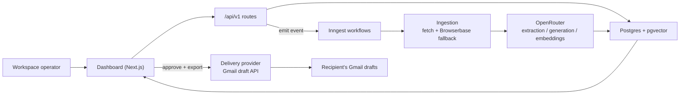
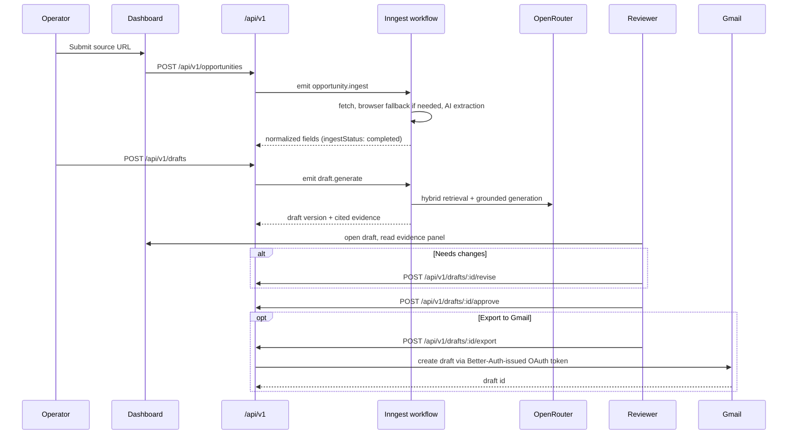
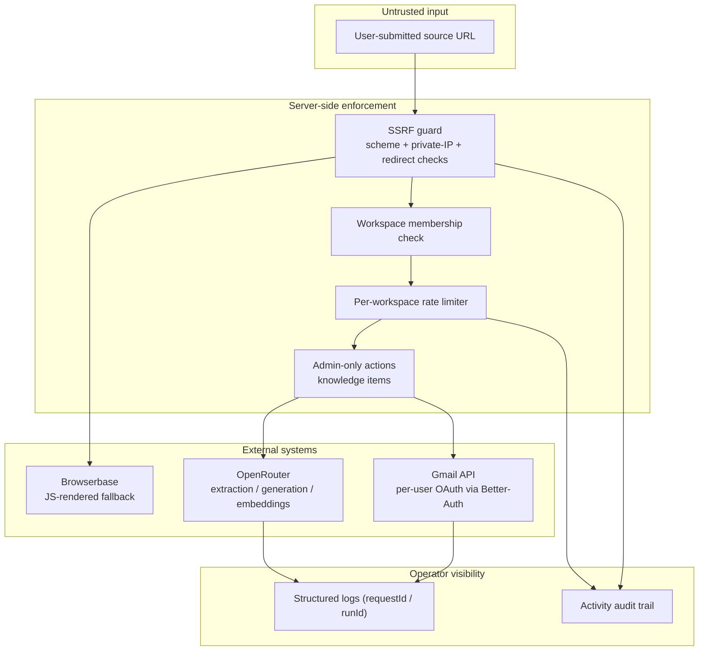

# Email GenAI

**Email GenAI** turns a company or job URL into a grounded, evidence-backed outbound email — extracted, drafted, and reviewed inside a multi-tenant workspace, with delivery kept one deliberate human action away from irreversible.

The project is built around one principle: **agentic drafting should be observable and reversible before it leaves the workspace.**

## Contents

- [Why This Exists](#why-this-exists)
- [System Overview](#system-overview)
- [Workflow Lifecycle](#workflow-lifecycle)
- [Domain Model](#domain-model)
- [Trust Boundaries](#trust-boundaries)
- [Repository Layout](#repository-layout)
- [Features](#features)
- [Local Development](#local-development)
- [Background Workflows (Inngest)](#background-workflows-inngest)
- [AI Configuration](#ai-configuration)
- [Authentication (Better-Auth)](#authentication-better-auth)
- [Gmail Export (Delivery)](#gmail-export-delivery)
- [Rate Limits & Abuse Protection](#rate-limits--abuse-protection)
- [Production Deployment](#production-deployment)
- [Security Notes](#security-notes)
- [Verification](#verification)

## Why This Exists

An AI can reasonably extract a job posting, retrieve the right proof points, and draft a cold outreach email. That's useful, but the failure mode is real: a wrong claim, an ungrounded pitch, or a sent email to the wrong contact doesn't undo itself.

Email GenAI never lets the model send anything directly. It can only produce a `Draft` — versioned, tied to the evidence it cited, and held for review until a human explicitly approves it. Delivery itself (Gmail draft export) writes into the reviewer's own Gmail drafts folder, not their sent mail — so even after approval, sending is still a separate, manual, human act.

This gives the system three practical safety properties:

- **Grounded before generated**: every draft is produced from normalized opportunity data plus retrieved `KnowledgeItem`s, and the citations are stored, not just the output.
- **Human in the loop, by construction**: no code path exists that goes from AI generation to sent email without an explicit `approve` action in between.
- **Auditable intent**: every ingest, generation, revision, approval, and export is written to an `Activity` record and structured logs, keyed by workspace, opportunity, and run id.

## System Overview



The workflow API is intentionally the only write path into the domain model. Everything around it exists to make ingestion, drafting, and approval visible, testable, and safe to operate from local development through production.

## Workflow Lifecycle



Ingestion and drafts each carry their own status machine:

- `ingestStatus`: `pending` → `running` → `completed` | `failed` (retryable from the UI).
- `draft.state`: `knowledge_matched` → `draft_generated` → `draft_reviewed` → `approved_for_send`.
- A `SendJob` records each export attempt (`pending` → `running` → `completed` | `failed`), independent of the draft's own state.

## Domain Model

The schema lives at [`src/db/schema.ts`](src/db/schema.ts).

Key roles (Better-Auth organization plugin, per workspace):

- `member`: can create opportunities, generate drafts, revise, approve, and export.
- `owner` / `admin`: everything a member can do, plus managing knowledge items and workspace members.

Core entities:

- `Workspace` — a thin uuid-keyed mirror of Better-Auth's `organization` table; membership/role is sourced live from Better-Auth's own `member` table, not mirrored locally. Every business row carries `workspaceId`, and cross-workspace access is rejected at the API layer.
- `Opportunity` — the normalized source of truth for one lead/job, with raw content, extraction metadata, and ingest status.
- `KnowledgeItem` — a proof point or case study, embedded for retrieval.
- `Draft` / `DraftVersion` — `DraftVersion` is append-only; every revision is a new row, never an overwrite.
- `Approval` — explicit, reviewer-attributed, with an optional note.
- `Activity` — the audit trail for every user and system event.
- `DeliveryAccount` / `SendJob` / `SendAttempt` — delivery is behind a swappable `DeliveryProvider` interface ([`src/lib/delivery/`](src/lib/delivery)); `gmail_draft` is implemented today, `manual_export` is the always-available fallback.

Key limits enforced server-side, not just in the UI:

- SSRF guard on every opportunity URL and redirect hop ([`src/lib/ingestion/url-safety.ts`](src/lib/ingestion/url-safety.ts)).
- Per-workspace rate limits on opportunity creation, re-ingestion, draft generation, and knowledge-item creation ([`src/lib/rate-limit.ts`](src/lib/rate-limit.ts)).
- `draft.state !== "approved_for_send"` blocks export with a 409, not just a hidden button.

## Trust Boundaries



The dashboard and API routes can request AI generation and Gmail export, but every one of those requests still passes through the SSRF guard, the rate limiter, workspace-membership scoping, and (for knowledge items) an admin-role check — none of which the client can bypass by calling the API directly.

## Repository Layout

- [`src/app/dashboard`](src/app/dashboard) — the operator UI: overview, opportunities, drafts, approvals, knowledge hub, settings.
- [`src/app/api/v1`](src/app/api/v1) — the workflow API; every route is workspace-scoped and Zod-validated.
- [`src/lib/ingestion`](src/lib/ingestion) — direct fetch + Browserbase fallback, and the SSRF guard.
- [`src/lib/ai`](src/lib/ai) — OpenRouter-backed extraction, hybrid retrieval, and grounded generation.
- [`src/lib/delivery`](src/lib/delivery) — the swappable delivery-provider interface (`gmail_draft`, `manual_export`).
- [`src/lib/workflows`](src/lib/workflows) — Inngest functions for ingest, generate, and embed.
- [`src/db/schema.ts`](src/db/schema.ts) — the Drizzle schema; `drizzle/` holds generated migrations.
- [`scripts/apply-indexes.mjs`](scripts/apply-indexes.mjs) — applies the hand-written index SQL `db:push` can't see.
- [`docs/specs`](docs/specs) — the spec-driven implementation roadmap, tracked in the repository.

## Features

- URL ingestion with static-page fetch plus Playwright/Browserbase fallback for JS-rendered pages
- AI extraction, hybrid retrieval (metadata + lexical + vector + RRF + MMR), and grounded draft generation via OpenRouter
- pgvector `halfvec` HNSW index for knowledge-item embeddings
- Self-hosted Google-only auth (Better-Auth) with an organization plugin for workspace tenancy — no separate hosted identity domain to register
- Append-only draft versions with human revision and reviewer-attributed approval
- Gmail draft export behind a swappable delivery-provider interface (ships disabled pending Google Cloud OAuth client setup)
- SSRF guard on every ingested URL and redirect hop
- Durable, per-workspace rate limiting on costly/abusable actions
- Admin-only enforcement on knowledge-item management
- Inngest background workflows with bounded retries and failure hooks
- Structured logs, request ids, and a full `Activity` audit trail
- CI on every push/PR: lint, typecheck, test, build ([`.github/workflows/ci.yml`](.github/workflows/ci.yml))

## Local Development

Install dependencies:

```bash
npm install
```

Create local environment variables:

```bash
copy .env.example .env.local
```

Apply the database schema (Neon recommended — any Postgres 15+ with the `pgvector` extension works; see the `DATABASE_URL` comment in `.env.example`):

```bash
npm run db:generate
npm run db:push
npm run db:indexes
```

`db:push` only syncs what's declared in `schema.ts` — every index (including the pgvector HNSW index) is hand-written SQL in `drizzle/*.sql` instead, so `db:indexes` is a required, separate step. Safe to re-run any time; run it again after pulling any migration that adds new indexes, and against every fresh database, including production.

Start the development server, and in a separate terminal, the Inngest dev server (required for background workflows):

```bash
npm run dev
```

```bash
npm run inngest
```

## Background Workflows (Inngest)

Ingestion, extraction, retrieval, and draft generation all run as Inngest functions, not inline in the request handler — see [`src/lib/workflows`](src/lib/workflows). Each function has a bounded retry count, a per-entity concurrency key (one run at a time per opportunity/draft), and a failure hook that marks the entity `failed` and writes an `Activity` record so it's retryable from the UI.

Locally, set `INNGEST_DEV=1` in `.env` and run `npm run inngest` alongside `npm run dev`. Leaving `INNGEST_DEV` unset defaults to cloud mode even with blank keys, which can't invoke functions on `localhost` — submitted opportunities/drafts will hang at "pending" forever if you forget this.

## AI Configuration

All extraction, generation, and embeddings run through OpenRouter's OpenAI-compatible API using free-tier models, overridable via env vars:

```env
OPENROUTER_API_KEY=
OPENROUTER_EXTRACTION_MODEL=
OPENROUTER_GENERATION_MODEL=
OPENROUTER_EMBEDDING_MODEL=
```

See [`docs/specs/004-ai-retrieval-spec.md`](docs/specs/004-ai-retrieval-spec.md) for the current default models, why embeddings are indexed as `halfvec` instead of `vector`, and the JSON-repair retry strategy used against free-tier models with unreliable structured-output support.

## Authentication (Better-Auth)

Sign-in is Google-only, self-hosted via [Better-Auth](https://www.better-auth.com) — no separate hosted identity domain to register, so there's nothing to fail when deploying to a new domain. Workspaces are Better-Auth's own `organization` plugin (see [Domain Model](#domain-model)).

Google Cloud Console setup (required for sign-in to work at all):

1. Create or select a Google Cloud project. Enable the **Gmail API** (APIs & Services → Library) — required for the Gmail export feature below, not just for requesting the scope.
2. **OAuth consent screen**: type "External"; add scopes `openid`, `.../auth/userinfo.email`, `.../auth/userinfo.profile`, and `https://www.googleapis.com/auth/gmail.compose` (the last one is what Gmail export needs — requested up front at sign-in since it's the same Google account either way).
   - `gmail.compose` is a Google *restricted* scope. While the consent screen is in "Testing" status, only Google accounts explicitly added as test users (~100 cap) can sign in at all — anyone else is blocked by Google, not by this app. Moving to "In production" with this scope requires Google's app verification and a CASA security assessment. Stay in Testing with your team's accounts added as test users until you're actually ready to publish.
3. **Credentials → Create OAuth client ID** (type "Web application"). Authorized JavaScript origins: `http://localhost:3000` (dev) and your deployed origin (prod). Authorized redirect URIs: `http://localhost:3000/api/auth/callback/google` (dev) and `https://<your-domain>/api/auth/callback/google` (prod).
4. Copy the Client ID/secret into `GOOGLE_CLIENT_ID`/`GOOGLE_CLIENT_SECRET`.

## Gmail Export (Delivery)

Approved drafts can be exported into the reviewer's own Gmail drafts folder — never sent directly — via `POST /api/v1/drafts/:id/export`. The button ships disabled with a tooltip until `GOOGLE_CLIENT_ID`/`GOOGLE_CLIENT_SECRET` are set up per the section above — no separate delivery-specific setup is needed, since the `gmail.compose` scope is requested at sign-in.

See [`docs/specs/010-future-delivery-spec.md`](docs/specs/010-future-delivery-spec.md) for the full rationale, including why this is a direct Gmail API integration today rather than the (Developer-Preview-gated) official Gmail MCP server.

## Rate Limits & Abuse Protection

Every action that triggers a paid external call (AI extraction/generation/embedding, browser automation) is rate-limited per workspace, durably, in Postgres — not in memory, since the app can run as multiple/ephemeral serverless instances:

| Action | Limit |
| --- | --- |
| Opportunity creation | 20 / 10 min |
| Re-ingestion | 10 / 10 min |
| Draft generation | 20 / 10 min |
| Knowledge item creation | 30 / 10 min |

See [`src/lib/rate-limit.ts`](src/lib/rate-limit.ts). Limits return the `rate_limited` API error code and a 429.

## Production Deployment

Link the repository directly to Vercel — `git push` to `main` triggers a build and deploy, no separate CD pipeline needed for this stack. Two things sit outside that automatic path:

- **CI** ([`.github/workflows/ci.yml`](.github/workflows/ci.yml)) runs lint, typecheck, the full test suite, and a build on every push/PR — Vercel's own build step only runs `next build`'s type/lint pass, not this project's vitest suite.
- **Database schema and indexes are never applied automatically.** Whenever `schema.ts` or `drizzle/*.sql` changes, run `npm run db:push && npm run db:indexes` by hand against the production database before or after deploying.

Before going live: move the Google OAuth consent screen out of Testing (see [Authentication](#authentication-better-auth)), register the app with Inngest Cloud and set `INNGEST_EVENT_KEY`/`INNGEST_SIGNING_KEY` (leave `INNGEST_DEV` unset), and confirm production API keys for OpenRouter/Browserbase/Blob.

## Security Notes

- Keep `BETTER_AUTH_SECRET`, Google OAuth, OpenRouter, Browserbase, and Blob keys out of git — `.env` is gitignored, only `.env.example` (blank values) is tracked.
- Every ingested URL is checked against the SSRF guard, including on each redirect hop — no scheme other than `http`/`https`, no loopback/link-local/RFC1918 destination.
- Every `/api/v1` route rejects requests without an authenticated user and an active workspace membership; cross-workspace access is denied at the query level, not just in the UI.
- Knowledge-item creation requires the `org:admin` role; other actions are member-level by design.
- Gmail export writes to the reviewer's Gmail *drafts*, never sends — final send is always a separate, manual, human action in Gmail itself.
- No external error-monitoring SaaS (e.g. Sentry) is wired up yet; structured logs are designed to be forwarded to one later without changing call sites.

## Verification

Run these after changes:

```bash
npm run lint
npm run typecheck
npm run test
cmd /c rmdir /s /q .next
npm run build
```

The test suite covers contract schemas, ingestion HTML extraction, the SSRF guard, the delivery-provider abstraction (Gmail client mocked, MIME building, error mapping), AI extraction/generation helpers, and Inngest workflow registration.
